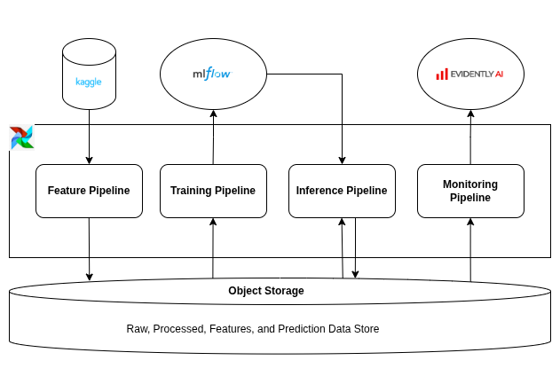
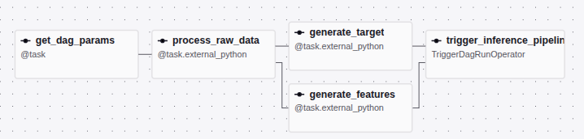
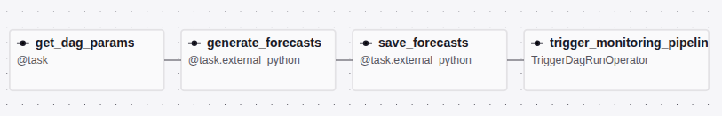
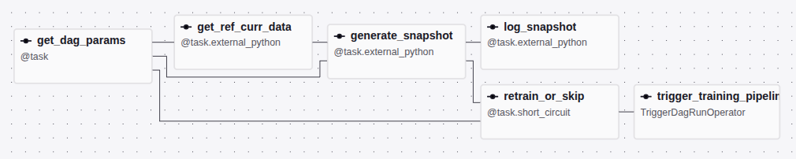
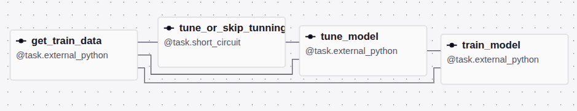

## Project Overview

This project focuses on forecasting store sales demand using historical sales data. It provides an end-to-end machine learning system managed by Apache Airflow, covering feature engineering, model training, inference, and drift monitoring.

The dataset for this project was sourced from the Kaggle "Store Sales - Time Series Forecasting" competition. It contains historical sales data for 33 product families across 54 stores, spanning from 2013-01-01 to 2017-08-15.

My focus for this project was to build an end-to-end ML system, so I didn’t do a lot of work on the feature engineering and model development steps. I tested a naive (previous 7-day sales) model and a decision tree model. I chose to deploy the naive model because it had a better performance than the decision tree model (even after tuning). The models were evaluated on the same subset of data in a backtesting manner by generating five 16-multi-step forecasts. The tuning of the decision tree model was also cross-validated in a similar manner.

## Tools Used

- **MLflow & Dagshub**: Used for tracking model experiments and logging models for future use.
- **Airflow**: Used for orchestrating the end-to-end process.
- **Evidently**: Used for calculating monitoring metrics and creating a monitoring dashboard.
- **MLforecast & Scikit-learn**: Used for building time-series forecasting models with machine learning algorithms.
- **Astronomer**: Used for Airflow production deployment
- **Garage**: Used for testing code integration with AWS S3.
- **AWS S3**: Used for storing project data in production.
- **GitHub Actions**: Used for automating the CI/CD workflow.

## System Architecture


The system is divided into 4 separate pipelines:

* **Feature pipeline**: This pipeline retrieves the raw data from Kaggle, transforms the raw data and loads it to the object store. The pipeline also generates features and target data from the processed data and loads it to the object store.
* **Training pipeline**: This pipeline pulls the feature and target data from the object store, optionally tunes a model, trains (or retrains) a model, and registers the model in MLflow.
* **Inference pipeline**: This pipeline pulls the feature data from the object store, pulls the model from MLflow server, generates forecasts, and saves the forecasts in the object store.
* **Monitoring pipeline**: This pipeline pulls the features and predictions from the object store, generates drift metrics for prediction and features, and saves the result to Evidently AI workspace.

The feature pipeline triggers the inference pipeline, which triggers the monitoring pipeline, which triggers the training pipeline if the model prediction drifted from the historical predictions.

### Feature pipeline DAG


### Inference pipeline DAG


### Monitoring pipeline DAG


### Training pipeline DAG



## How to Deploy

Follow the steps below to deploy the project to your Airflow deployment on Astronomer:

1. Install [Docker](https://docs.docker.com/engine/).
2. Install [Astro CLI](https://www.astronomer.io/docs/astro/cli/install-cli).
3. Install Make if not already installed.
4. Create an Airflow deployment on Astronomer with an A10 worker type.
5. Create an S3 bucket on AWS.
6. Create a repository on Dagshub to serve as the MLflow server.
7. Create an Evidently AI account.
8. Clone the repository:
    
    `git clone https://github.com/tiloye/store-sales-demand-forecasting.git`
    
9. Switch to the project directory.
10. Create a `.env.prod` file and paste the contents below:
    
    ```bash
    ENV_NAME=prod
    
    KAGGLE_API_TOKEN=YOUR-KAGGLE-API-KEY
    
    MLFLOW_TRACKING_URI=YOUR-DAGSHUB-MLFLOW-TRACKING-URI
    MLFLOW_TRACKING_USERNAME=YOUR-DAGSHUB-USERNAME
    MLFLOW_TRACKING_PASSWORD=YOUR-DAGSHUB-ACCESS-TOKEN
    
    EVIDENTLY_API_KEY=YOUR-EVIDENTLY-API-KEY
    EVIDENTLY_ORG_ID=YOUR-EVIDENTLY-ORGANIZATION-ID
    
    AWS_ENDPOINT_URL=https://s3.amazonaws.com
    AWS_ACCESS_KEY_ID=YOUR-AWS-ACCESS-KEY-ID
    AWS_SECRET_ACCESS_KEY=YOUR-AWS-SECRET-ACCESS-KEY
    AWS_REGION=YOUR-AWS-ACCOUNT-REGION
    S3_BUCKET_NAME=YOUR-S3-BUCKET-NAME
    
    ASTRO_API_TOKEN=YOUR-ASTRO-API-TOKEN
    ASTRO_DEPLOYMENT_ID=YOUR-ASTRO-DEPLOYMENT-ID
    ```
    
11. Create the environment variables needed for the project in your Airflow deployment:
    
    `make create-astro-deployment-variables ENV=prod`
    
12. Deploy the project:
    
    `astro deploy YOUR-ASTRO-DEPLOYMENT-ID`

13. Activate the feature, training, inference, and monitoring pipelines in the Airflow UI.

14. Manually trigger the feature pipeline to run ETL and generate features and target files. Wait for it to complete before proceeding to the next step.

15. Manually trigger the training pipeline to train and register a model. Wait for it to complete before proceeding to the next step.

16. Retry failed inference pipeline DAG run triggered by the feature pipeline DAG.

**Note**: Triggering the monitoring pipeline DAG will fail because it will try to calculate drift by comparing the latest forecasts to historical forecasts, which are not available. You can create a drift report by passing custom “curr” and “ref” start and end date parameters to the DAG. The parameters should be between 2017-08-16 and 2017-08-31.

## Local Development Setup

Follow the steps below to set up the project for local development:

1. Install [Docker](https://docs.docker.com/engine/).
2. Install [uv](https://docs.astral.sh/uv/getting-started/installation/).
3. Install Make if not already installed.
4. Create a repository on Dagshub to serve as the MLflow server if not already created.
5. Create an Evidently AI account.
6. Clone the repository:
    
    `git clone https://github.com/tiloye/store-sales-demand-forecasting.git`
    
7. Switch to the project directory.
8. Install the project and its dependencies:
    
    `uv sync`
    
9. Create data directories:
    - `data/raw`
    - `data/processed`
    - `data/feature_store`
    - `data/predictions`
10. Create a `.env.dev` file and paste the contents below:
    
    ```bash
    ENV_NAME=dev
    
    KAGGLE_API_TOKEN=YOUR-KAGGLE-API-KEY
    
    MLFLOW_TRACKING_URI=YOUR-DAGSHUB-MLFLOW-TRACKING-URI
    MLFLOW_TRACKING_USERNAME=YOUR-DAGSHUB-USERNAME
    MLFLOW_TRACKING_PASSWORD=YOUR-DAGSHUB-ACCESS-TOKEN
    
    AWS_ENDPOINT_URL=http://localhost:3900 # Garage container endpoint
    AWS_ACCESS_KEY_ID=GK0123456789012345678901234567890123456789 # Garage container custom access key
    AWS_SECRET_ACCESS_KEY=400db5aebbdb6e4d5a9bfe70c7d5277a4be996026f9452d3500ebe2734e4d185 # Garage container custom secret key
    AWS_REGION=garage # Garage container region
    S3_BUCKET_NAME=ssdf-dev # Garage container bucket name
    ```
    
11. Activate the project environment (depends on your operating system).

12. Run tests:
    
    `make test`
    
13. Stop the Garage container:
    
    `make stop-garage`
14. Download the dataset:
    `uv run python src/ssdf/data.py`

## Project Folder Structure
```text
.
├── dags/                  # Airflow DAGs (feature, inference, monitoring, training)
├── data/                  # Local data storage (raw, processed, feature_store, predictions)
├── notebooks/             # EDA, baseline, and experimental Jupyter notebooks
├── src/ssdf/              # Main source code package
│   ├── features/          # Feature engineering modules
│   ├── inference/         # Batch Prediction and submission generation
│   ├── monitoring/        # Evidently monitoring metrics and dashboard modules
│   └── training/          # Model training, evaluation, and tuning modules
├── tests/                 # Unit tests for the various pipeline components
├── Dockerfile             # Docker image configuration for Astro runtime
├── garage.toml            # Garage object store configuration
├── Makefile               # Make commands for CLI operations
├── pyproject.toml         # Project metadata and dependencies configuration
├── requirements.txt       # Project dependencies for Astronomer/Airflow
└── uv.lock                # Locked dependencies for deterministic builds
```

## Areas of Improvement

- Try other models.
- Engineer and explore more features.
- Use a feature store or delta table for data versioning.
- Validate data inputs with Pandera, Great Expectations, or Soda.
- Setup alerts for failed dag runs and drift detection.
- Integrate pre-commit hooks for automated code formatting and linting.
- Use terraform to automate the provisioning of S3 bucket and Astronomer deployment.
- Create separate branches for development and production code, and only deploy on pull request to the main branch.

## Resources Used

- [Store Sales Timeseries Forecasting dataset](https://www.kaggle.com/competitions/store-sales-time-series-forecasting/data)
- [MLforecast Documentation](https://nixtlaverse.nixtla.io/mlforecast/index.html)
- [Datatalksclub MLOps Zoomcamp](https://github.com/DataTalksClub/mlops-zoomcamp)
- [Evidently documentation](https://docs.evidentlyai.com)
- [Airflow documentation](https://airflow.apache.org/docs/apache-airflow/stable/)
- [Astronomer documentation](https://www.astronomer.io/docs/)
- [Garage documentation](https://docs.garage.cloud/)